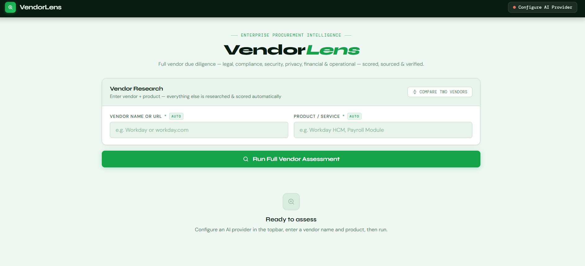

# VendorLens — Enterprise Vendor Due Diligence SPA

An intelligent single-page application for conducting thorough vendor assessments across legal, compliance, security, privacy, financial, and operational dimensions. VendorLens crawls public vendor pages, extracts structured evidence using AI and grounded citations, and delivers comprehensive procurement risk reports.

## Features

✨ **Multi-Provider AI Support**
- 8 LLM providers: Groq (free), Google Gemini, OpenAI, Anthropic Claude, Azure OpenAI, Mistral, Together AI, Ollama
- Provider health monitoring with live status chips
- Automatic rate-limit detection and sequential fallback for constrained providers
- Token budget estimator to warn before hitting TPM limits

🔍 **Intelligent Web Scraping**
- Parallel crawl of 25+ priority vendor pages (security, privacy, compliance, trust centers, etc.)
- Jina AI Reader integration for JavaScript-heavy sites
- Server-side scraper + CORS proxies as fallback
- Discovered link expansion (crawls secondary pages found on primary pages)
- Vector indexing for context-aware synthesis

🤖 **Multi-Agent AI Analysis**
- 5 parallel agents: Compliance & Certifications, Security, Privacy & Data, Legal & Financial, Synthesis
- Structured JSON output with field-level confidence scores
- Source citations and evidence snippets for every finding
- Evidence-first approach: scraped facts are grounded before AI enrichment

📋 **Grounded Extractions**
- LangExtract service for zero-hallucination field extraction
- Character-level source citations—trace every claim back to the webpage
- High/medium/low confidence attribution per field
- Fallback to evidence-only assessment when AI is unavailable

📊 **Comprehensive Assessment Output**
- Scores: Overall (0–100), Legal/Financial, Compliance, Security, Privacy, Access Risk, Operational
- Certifications: SOC 2, ISO 27001, HIPAA, PCI-DSS, FedRAMP, GDPR, CCPA, CSA STAR, and more
- Security posture: encryption, MFA, SSO, penetration testing, incident response, breach history
- Privacy & data: DPA availability, GDPR compliance, data retention, subprocessors
- Legal & operational: company info, contract terms, uptime SLA, support tiers
- Risk flags with severity levels (red, amber, green)
- Vendor history timeline with sources

🔐 **Security & Auth**
- Optional password-protected access
- HMAC-signed session tokens (24-hour validity)
- Server-side AI proxy (bypass browser CORS restrictions)

🔄 **Vendor Comparison**
- Compare side-by-side assessments of multiple vendors
- Highlight differences in compliance posture, security, and pricing

## Screenshots

### Home Page — Vendor Research

*Enter a vendor name or domain and product/service to begin assessment*

## Architecture

```
┌─────────────────────────────────────────────────────────────┐
│           vendor-intel.html (3700+ lines)                    │
│     Frontend SPA: UI, crawling orchestration, AI agents       │
└──────────────┬───────────────────────┬──────────────────────┘
               │                       │
               ▼                       ▼
        ┌──────────────┐      ┌──────────────────┐
        │ static-server.js     │  extract-service.py
        │ (Node.js HTTP)       │  (Flask LangExtract)
        │                      │
        │ - Page scraping      │ - Grounded citations
        │ - Auth gate          │ - Zero hallucination
        │ - AI proxy           │ - Source tracking
        │ - crawl4ai relay     │
        └──────────────┘      └──────────────────┘
        Port 5000              Port 5001
```

### Tech Stack
- **Frontend**: Vanilla JavaScript (no frameworks) — ~3800 lines of single-file HTML/CSS/JS
- **Backend**: Node.js HTTP server (static-server.js)
- **Extraction**: Python Flask + LangExtract library
- **Rendering**: Server-side fetch + Jina AI Reader API + CORS proxy chain
- **AI**: OpenAI, Gemini, Groq, Anthropic, Azure, Mistral, Together, Ollama

## Installation & Setup

### Prerequisites
- Node.js 18+
- Python 3.11+
- API keys for at least one LLM provider (Groq, Gemini, OpenAI, Anthropic, etc.)

### Quick Start

1. **Clone the repository**
   ```bash
   git clone https://github.com/yourusername/vendorlens.git
   cd vendorlens
   ```

2. **Install dependencies**
   ```bash
   npm install
   pip install -r requirements.txt
   ```

3. **Set environment variables**
   ```bash
   # Optional: enable password protection
   export VL_PASSWORD=yoursecretpassword
   
   # Optional: connect crawl4ai instance (for advanced scraping)
   export VL_CRAWL4AI_URL=http://localhost:11235
   
   # Optional: server port (default 5000)
   export PORT=5000
   ```

4. **Run the application**
   ```bash
   npm start
   # or directly:
   node static-server.js
   ```

5. **Open in browser**
   ```
   http://localhost:5000
   ```

## Configuration

### AI Provider Setup

VendorLens supports 8 LLM providers. Configure at least one:

**Groq (Free & Fast)**
- Get API key: https://console.groq.com
- Models: `mixtral-8x7b-32768`, `llama-3.1-70b-versatile`, `llama-3.1-8b-instant`
- No cost for reasonable usage; 6k TPM free tier

**Google Gemini (Free Tier)**
- Get API key: https://aistudio.google.com/app/apikeys
- Model: `gemini-2.0-flash` (recommended)

**OpenAI**
- Get API key: https://platform.openai.com/account/api-keys
- Models: `gpt-4o`, `gpt-4o-mini` (recommended)

**Anthropic Claude**
- Get API key: https://console.anthropic.com/account/keys
- Models: `claude-opus`, `claude-sonnet`, `claude-sonnet-4-5`

**Azure OpenAI**
- Requires: Resource URL, deployment name, API key
- Set up: https://portal.azure.com

**Mistral AI**
- Get API key: https://console.mistral.ai
- Models: `mistral-large-latest`

**Together AI**
- Get API key: https://www.together.ai/
- Models: `meta-llama/Llama-3-70b-chat-hf`

**Ollama (Local)**
- Download: https://ollama.ai
- Run: `ollama serve`
- Models: `llama2`, `mistral`, etc.

### Authentication

To enable password protection:

```bash
export VL_PASSWORD=mysecretpassword
```

Login tokens are HMAC-signed and valid for 24 hours per session.

### Advanced: Custom Scraper (crawl4ai)

For better rendering of JavaScript-heavy vendor sites:

```bash
# Start crawl4ai container
docker run -p 11235:11235 uncloudinary/crawl4ai:latest

# Point VendorLens to it
export VL_CRAWL4AI_URL=http://localhost:11235
```

## API Endpoints

### Frontend Pages
- `GET /` — Main application

### Scraping & Fetching
- `GET /api/scrape?url=<url>` — Server-side page fetcher with cache-busting
- `POST /api/crawl4ai` — Proxy to crawl4ai instance (if configured)

### AI & Extraction
- `POST /api/proxy-ai` — Relay AI calls through server (bypasses browser CORS)
- `POST /api/extract` — Call LangExtract service for grounded field extraction
- `GET /api/extract/health` — Health check for extraction service

### Config & Auth
- `GET /api/config` — Returns `{authRequired: bool, crawl4aiConfigured: bool}`
- `POST /api/auth` — Validate password, return signed session token
- `GET /api/health` — Server health check

## Crawl Pipeline

1. **URL Pre-Validation** (Optional)
   - HEAD-check 25 priority URLs to confirm reachability
   - Filter out unreachable URLs before scraping

2. **Parallel Page Fetch** (25 Priority Pages)
   - Fetch pages from `/security`, `/privacy`, `/compliance`, `/trust-center`, etc.
   - For each URL: try Jina (headless render) → fall back to server scraper → try CORS proxies
   - Jina is preferred for JS-heavy SPAs; server scraper is faster for static sites

3. **Link Discovery** (Up to 25 Secondary Links)
   - Extract internal links from primary pages
   - Filter: compliance-related keywords (security, privacy, DPA, SOC, ISO, etc.)
   - Fetch in parallel

4. **Content Cleaning**
   - Strip HTML tags, scripts, styles, navigation lines
   - Remove Jina metadata headers
   - Limit to 25k chars per page
   - Deduplicate content

5. **Vector Indexing**
   - Chunk content into ~400-char segments
   - Index with keyword extraction for semantic search

6. **Context Building**
   - Aggregate compliance-ranked content for compliance agent
   - Aggregate security/encryption content for security agent
   - Aggregate privacy/GDPR content for privacy agent
   - Full-text synthesis context for final verdict

## Multi-Agent Analysis

**Sequential vs. Parallel Execution**
- High-TPM providers (Gemini, OpenAI, Anthropic): 5 agents run in parallel
- Low-TPM providers (Groq free tier: 6k TPM): agents run sequentially with ~26–60s delays to respect rate limits

**Agent Prompts**
Each agent receives:
- List of confirmed reachable URLs (prevents hallucination)
- Relevant scraped content
- Strict JSON schema with null defaults
- Field-source tracking instructions

**Output Format**
```json
{
  "compliance": { /* SOC 2, ISO 27001, HIPAA, etc. */ },
  "security": { /* encryption, MFA, incident response, etc. */ },
  "privacy_data": { /* GDPR, DPA, data retention, etc. */ },
  "access_risk": { /* data access, subprocessors, criticality */ },
  "legal_financial": { /* company info, funding, contracts */ },
  "operational": { /* uptime SLA, support, disaster recovery */ },
  "product": { /* features, pricing, deployment */ },
  "scores": { /* grades A–F per domain, overall 0–100 */ },
  "flags": [ /* risk alerts with evidence */ ],
  "verdict": { /* recommendation, risk tier, summary */ },
  "vendor_log": [ /* timeline of significant events */ ],
  "_field_sources": { /* evidence citations for every field */ }
}
```

## Grounded Extractions (LangExtract)

LangExtract runs **after** AI synthesis completes (no token competition).

**Benefits:**
- Zero hallucination: every extracted field points to exact webpage text
- Confidence scoring: 0.9+ = direct quote, 0.5–0.69 = inferred, <0.5 = best guess
- Field-level citations: trace `soc2_type2='Yes'` back to the URL and evidence snippet

**How It Works:**
1. AI agents produce initial assessment
2. LangExtract analyzes scraped pages for missed facts
3. Evidence-backed fields fill gaps in AI output
4. AI values are never overwritten by incomplete extractions

## Token Budget & Rate Limits

VendorLens automatically detects provider rate limits:

- **Groq free tier**: 6k TPM → switches to sequential mode, reduces context, delays agents
- **Other providers**: 10k+ TPM → runs 5 agents in parallel
- **Token budget checker**: warns before hitting monthly TPM limits

**Sequential Mode Strategy** (for rate-limited providers)
- Agent 1 (compliance): 3200 chars context, 800 tok output
- 26–60s delay (TPM-dependent)
- Agent 2 (security): same budget + delay
- … and so on for privacy, legal, synthesis

## Troubleshooting

### "NA for all information"
- **Cause**: Scraped content wasn't making it to AI context
- **Solution**: Ensure Jina API is reachable, check vendor domain inference
- **Debug**: Open browser console → check `crawlLog` array to see what pages were fetched

### Rate limit errors
- **Cause**: Too many tokens in parallel for Groq free tier
- **Solution**: App auto-detects and switches to sequential mode; wait for delays
- **Manual**: Lower `seqCtxLen` (line 2431 in vendor-intel.html) to reduce context size

### Empty or 404 pages
- **Cause**: Vendor site structure differs from expected URL patterns
- **Solution**: Check crawl panel in UI; manually verify reachable pages
- **Debug**: Use `/api/scrape?url=<url>` endpoint to test individual pages

### Python extraction service fails
- **Cause**: LangExtract dependency missing or Python version mismatch
- **Solution**: `pip install -r requirements.txt`, ensure Python 3.11+

## Development

### Local Testing
```bash
# Terminal 1: Start app
node static-server.js

# Terminal 2: Tail logs
tail -f /tmp/logs/Start_application_*.log

# Terminal 3: Test endpoints
curl http://localhost:5000/api/health
curl http://localhost:5000/api/config
```

### Browser Console Debugging
```javascript
// View crawl log
console.table(crawlLog);

// View vector store
console.table(vectorStore);

// Check last assessment
console.log(gData);

// Test scraper
await fetchProxy('https://stripe.com/security');
```

### Code Structure
- **UI Rendering**: Lines 1–1000 (modals, tabs, results display)
- **Scraping**: Lines 1600–1900 (fetchProxy, cleanHtml, link extraction)
- **Vector Search**: Lines 1800–1850 (semantic context matching)
- **AI Agents**: Lines 2340–2500 (prompts, agent definitions, merge logic)
- **LangExtract**: Lines 2518–2600 (grounded citation integration)
- **Evidence Assessment**: Lines 2285–2335 (fallback assessment)

## Performance

**Typical Crawl Time**: 12–35 seconds
- 25 priority pages fetched in parallel: ~8s (Jina API ~5–8s per page)
- 5–10 discovered pages fetched: ~5s
- Vector indexing: <1s
- AI synthesis: 8–20s (depends on provider TPM and context size)

**Token Usage** (typical vendor):
- Compliance agent: 400–600 tokens
- Security agent: 350–500 tokens
- Privacy agent: 300–450 tokens
- Legal agent: 250–400 tokens
- Synthesis agent: 600–900 tokens
- **Total**: ~2k–2.8k tokens for full assessment

## Contributing

Contributions are welcome! Areas for improvement:
- Additional scraper backends (Playwright, Puppeteer)
- More AI providers (Claude Opus, OpenAI o1, etc.)
- Enhanced compliance frameworks (SOC 3, IRAP, C5, etc.)
- UI/UX refinements
- Performance optimizations
- Automated test suite

## License

MIT

## Support

For issues, questions, or feature requests, open a GitHub issue or contact the maintainers.

---

**VendorLens** — making vendor due diligence intelligent, transparent, and grounded in evidence.
